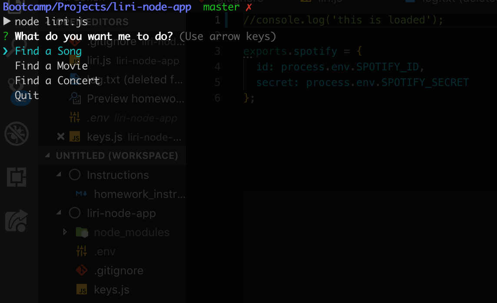
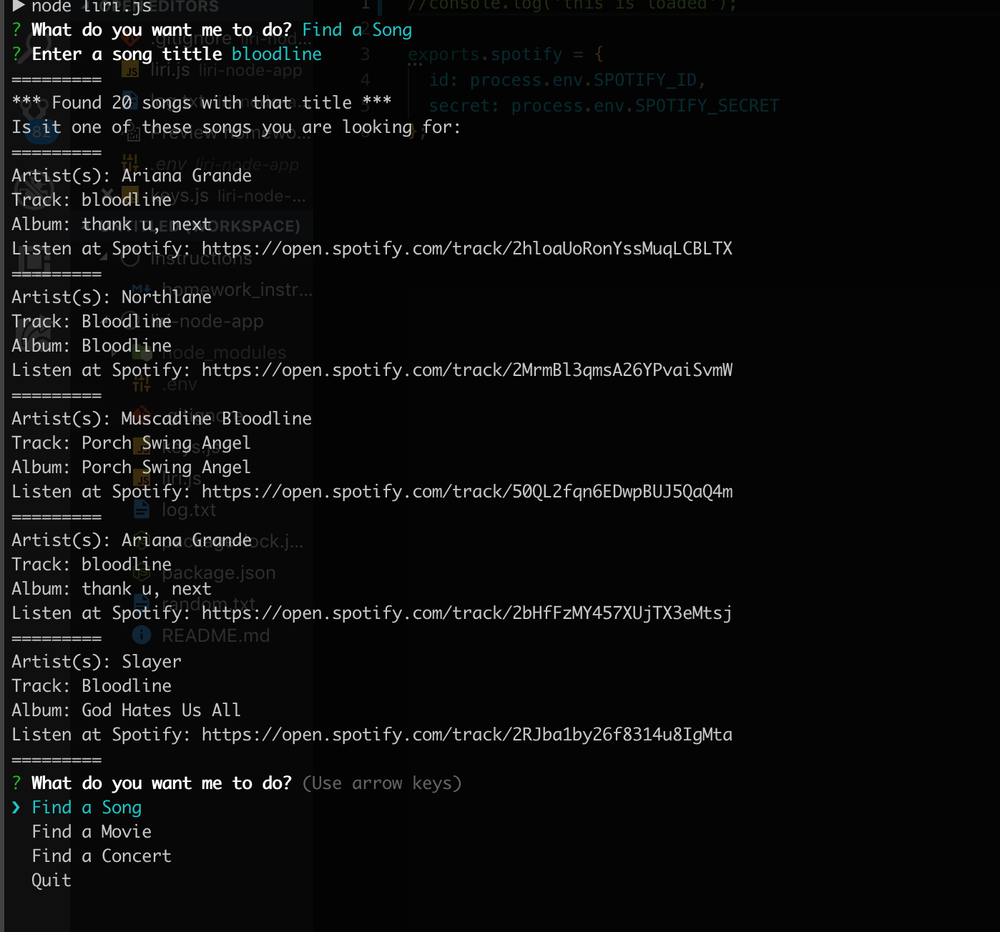
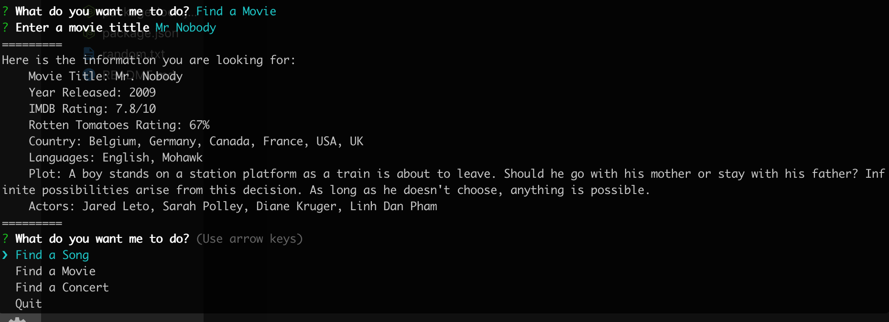
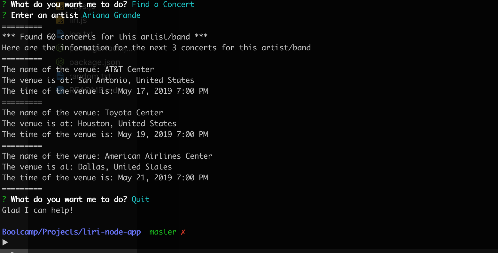
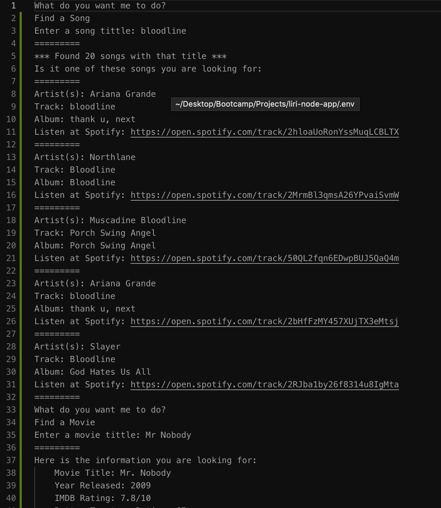

# LIRI - Language Interpretation and Recogonition Interface
### By Bogac Sabuncu

## Description
LIRI is like iPhone's SIRI. However, while SIRI is a Speech Interpretation and Recognition Interface, LIRI is a Language Interpretation and Recognition Interface. LIRI will be a command line node app that takes in parameters and gives you back data. 

LIRI can give you information on the following:

* Concerts
* Songs
* Movies

## Technologies Used
* The app is writen in Node.js
* It uses various Node packages like:
    - Inquirer - for command line inputs
    - Axios - for API Calls to OMDB and BandsInTown
    - Moment - for displaying date-time information
    - Node-Spotify-API - for retieving song information from Spotify
    - fs - for creating the logs
    - DotEnv for accessing and hiding the Spotify API Keys

## Tutorial




1. You run the app by going to the folder its in and typing the command "node liri.js" (You should probably run "npm install" too).

2. When you first run the it prompts you to pick from 3 options.




3. When you write the name of song it searches the song on Spotify using the spotify's node package and displays the first 5 results on the screen.



4. When you pick the movie option it prompts you to enter a movie title and gives you information about the movie from OMDB.



5. When you pick the concert option, it asks you to enter an artist and gives you the upcoming 3 concerts of the artist and relevant information about the venue.



6. You can find all the console logs of the session in the "log.txt" file. This file resets when you restart the app, so you don't see the log of the previous sesions.

7. The app also does user validation, when you dont enter an input it warns you to enter one, and if it cant find any information on the input it informs you of that.

8. App runs indefinetly until you press the "Quit" option.

9. If you want to run it on your computer you need to create a .env file and add your own spotify API keys like the following example:
```js
# Spotify API keys

SPOTIFY_ID=your-spotify-id
SPOTIFY_SECRET=your-spotify-secret

```
